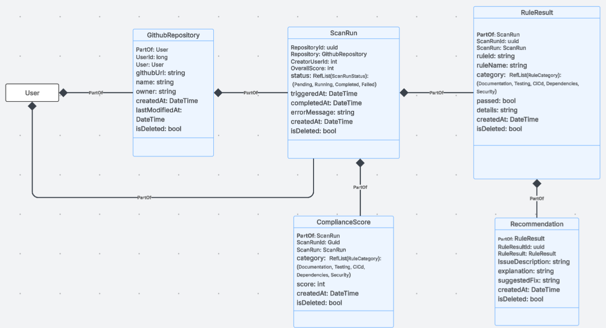

# 🛡️ RepoGuardian

## What is RepoGuardian?

RepoGuardian is a modern SaaS compliance tool that scans public GitHub repositories against a set of best-practice rules and generates AI-powered reports. It gives development teams instant visibility into how well their repos follow documentation, testing, CI/CD, dependency, and security standards — with specific, actionable fix recommendations for every failure.

RepoGuardian demonstrates real-world multi-tenant architecture, a rule engine with AI explainability, provider-based state management, and a clean full-stack integration between an ASP.NET Core backend and a Next.js frontend.

---

## 🌐 Live Demo

🔗 Coming soon

---

## 🎨 Mockup

[View UI mockup on Figma](https://www.figma.com/design/D2RNdVVw2kd5raIAc33KD6/Untitled?node-id=10-21&t=9JzKq03bKWOgY64g-1)

---

## 🗂️ Domain Model



[View Domain Model on Lucidchart](https://lucid.app/lucidspark/eb6fa5db-38e6-4c1e-a748-38510f2f0fdf/edit?viewport_loc=1600%2C-7930%2C3546%2C1699%2C0_0&invitationId=inv_6b02bda1-d24a-4f11-870d-08f6a6a5bb9d)

---

## 📄 Pages

| Page | Description |
|------|-------------|
| Login | Authenticate with your team credentials |
| Register | Create a new team account |
| Dashboard | Compliance score overview, trend chart, and stats filtered by branch |
| Repositories | List all repos in your team, search, add new repos, and scan |
| Repository Detail | Per-repo scan history, trend chart, and score badge for the default branch |
| Scans | All scans across all repos, with full results and quick-scan capability |

---

## 🧩 Components & Functional Requirements

### 1. Authentication
- Register a new team (creates a tenant) with a team name, username, and password
- Log in using team name, username, and password
- Session stored as an encrypted JWE cookie (server-side only)
- Unauthenticated users are redirected to login from all protected routes

### 2. Dashboard
- Overall compliance score across all repos
- Total repo count and total scan count
- Most recent scan details
- Repos below a configurable score threshold
- Trend chart showing compliance scores over the last 30 days
- Branch filter: default branch only (main/master) or all branches

### 3. Repositories
- List all repos registered under the current team
- Search and filter repos
- Add a new repo by GitHub URL
- Scan any repo — branch selector modal fetches available branches from GitHub
- Inline scan result popup with category scores, rule results, and AI recommendations

### 4. Repository Detail
- Repo metadata: name, owner, GitHub URL
- Score badge from the latest default-branch scan with branch pill indicator
- Trend chart of scan scores over time
- Full scan history table with branch column
- View full results for any past scan
- Scan button with branch selector

### 5. Scans
- All scans across the tenant, sorted latest first
- Branch column in history table
- View full results for any scan
- Quick-scan modal: pick an existing repo and branch, or enter a new GitHub URL

### 6. Scan Results Popup (shared)
- Category score gauges: Documentation, Testing, CI/CD, Dependencies, Security
- Full rule results table (rule name, category, passed/failed, detail)
- AI-generated recommendations panel for every failed rule (issue, explanation, fix)
- Branch indicator showing which branch was scanned

### 7. Compliance Rules

10 rules across 5 categories:

| Rule ID | Name | Category |
|---------|------|----------|
| DOC_001 | README exists | Documentation |
| DOC_002 | LICENSE exists | Documentation |
| DOC_003 | CONTRIBUTING guide exists | Documentation |
| TEST_001 | Test files or test directory exists | Testing |
| CICD_001 | CI/CD pipeline configured | CI/CD |
| CICD_002 | Linting or formatting config exists | CI/CD |
| DEP_001 | Dependency lock file exists | Dependencies |
| SEC_001 | .gitignore exists | Security |
| SEC_002 | No .env files committed | Security |
| SEC_003 | Security policy or CODEOWNERS exists | Security |

### 8. AI Recommendations
- Powered by Google Gemini (`gemini-2.5-flash`)
- Each failed rule gets an AI-generated issue description, explanation, and suggested fix
- Recommendations are saved per scan run and shown in the results popup

### 9. State Management
- Provider-based state management using the `redux-actions` pattern
- Each domain (repositories, scans, dashboard, repository detail) has its own context, actions, reducer, and provider
- All API calls dispatch pending, success, and error actions

### 10. UI / UX
- Fully responsive layout for all screen sizes
- Ant Design component library with `antd-style` CSS-in-JS
- Skeleton loaders during data fetching
- Score badges colour-coded: green (≥80%), amber (50–79%), red (<50%)

---

## ⚙️ How to Run Locally

### Prerequisites

- Node.js 20+
- .NET 8 SDK
- PostgreSQL 14+
- Google AI Studio API key (Gemini)

---

### Backend (`9.4.2/aspnet-core/`)

**1. Configure secrets**

Create `src/FullStackProject.Web.Host/appsettings.Development.json`:

```json
{
  "ConnectionStrings": {
    "Default": "Host=localhost;Database=FullStackProjectDb;Username=postgres;Password=your-password"
  },
  "Gemini": {
    "ApiKey": "your-google-ai-studio-key"
  }
}
```

**2. Apply database migrations**

```bash
dotnet run --project src/FullStackProject.Migrator
```

**3. Start the API**

```bash
dotnet run --project src/FullStackProject.Web.Host
```

Swagger UI is available at `/swagger` on the URL printed in the terminal.

---

### Frontend (`9.4.2/nextjs/`)

**1. Install dependencies**

```bash
npm install
```

**2. Configure environment**

```bash
cp .env.example .env.local
```

Open `.env.local` and set:

```env
API_URL=http://localhost:<your-backend-port>
SESSION_SECRET=any-random-string-at-least-32-chars
```

**3. Start the dev server**

```bash
npm run dev
```

Open the URL shown in the terminal.

---

### Docker (full stack)

```bash
cd 9.4.2/aspnet-core/docker/ng
Gemini__ApiKey=your-key docker compose up --build
```

---

## 🧪 Tech Stack

### Frontend

| Technology | Purpose |
|------------|---------|
| Next.js 16 | React framework with App Router |
| React 19 | UI rendering |
| TypeScript | Type-safe development |
| Ant Design | UI component library |
| antd-style | CSS-in-JS styling with `createStyles` |
| Axios | HTTP client for API calls |
| redux-actions | Provider-based state management |
| jose | JWE session cookie encryption |

### Backend

| Technology | Purpose |
|------------|---------|
| ASP.NET Core 8 | Web API host |
| ABP Framework v9.4 | Multi-tenancy, auth, DI, auditing |
| Entity Framework Core | ORM and migrations |
| PostgreSQL | Primary database |
| Google Gemini API | AI-generated fix recommendations |
| GitHub REST API | File tree and branch fetching |
| Castle Windsor | IoC container (ABP default) |

---

## 📁 Project Structure

```
9.4.2/
├── aspnet-core/
│   └── src/
│       ├── FullStackProject.Core                # Domain entities and services
│       ├── FullStackProject.Application         # App services, DTOs, rule engine, AI
│       ├── FullStackProject.EntityFrameworkCore # EF Core DbContext and migrations
│       ├── FullStackProject.Web.Core            # JWT config, base controllers
│       ├── FullStackProject.Web.Host            # Startup, middleware pipeline
│       └── FullStackProject.Migrator            # Standalone migration runner
│
└── nextjs/
    └── src/
        ├── app/
        │   ├── (auth)/          # Login and register pages
        │   ├── (main)/          # Dashboard, repositories, scans pages
        │   └── api/             # Next.js API routes (proxy to backend)
        ├── components/          # UI components grouped by feature
        ├── providers/           # React context providers for data fetching
        ├── Types/               # TypeScript interfaces and types
        └── lib/                 # Session helpers, ABP API client, DAL
```

---

## 👨‍💻 Developer

| | |
|-|-|
| Project | RepoGuardian |
| Developer | Vuyani Matshungwana |
| Type | Full-Stack SaaS Web Application |
| Purpose | Learning Project — GitHub Repository Compliance Scanner |

---

## 📄 License

This project was developed as a learning project. All rights reserved.
